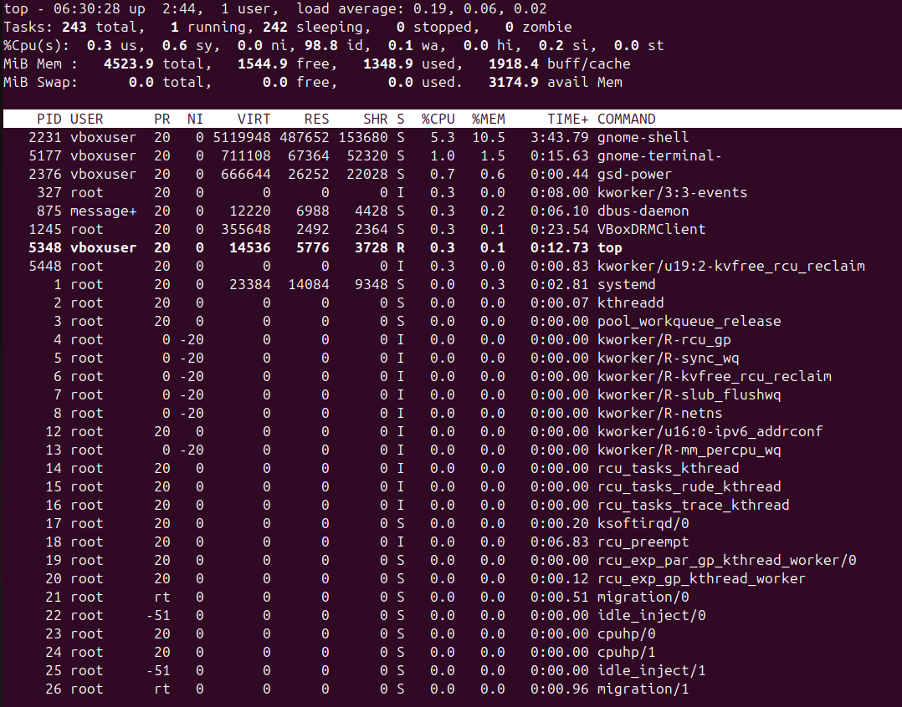
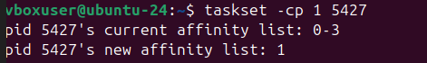

### COMMANDS ###

## 👉🏻 1. Adjusting Process Priority 
```bash
ps aux
```


a → show processes for all users

u → show user/owner of process

x → show processes not attached to a terminal


* Key Columns in ps aux Output
The command produces a detailed table with information about each process. Here are the most important columns:
```bash
Column	Description
`USER`	The username of the process owner.
`PID`	The unique Process ID. Used with commands like kill and renice.
`%CPU`	The percentage of CPU time the process is currently using.
`%MEM`	The percentage of physical memory (RAM) the process is currently using.
`VSZ`	Virtual Memory Size (in KiB). The total virtual memory the process is using.
`RSS`	Resident Set Size (in KiB). The actual physical memory (RAM) the process is holding that is not swapped out.
`TTY`	The controlling terminal. A ? means the process is not attached to a terminal (daemon/service).
`STAT`	The Process State Code. Common codes include: R (Running), S (Sleeping/waiting), Z (Zombie/defunct), T (Stopped).
`START`	The time or date the command started.
`TIME`	The cumulative CPU time the process has consumed.
`COMMAND`	The full command line that started the process, including arguments.
```


***Example Output:**
 
  


### 🌲 2. Process Tree 

**Command:**

pstree -p

**Example Output:**

 

**👉 Shows parent-child process relationships.**

**📊 3. Real-Time Monitoring**

Command:

top

#### Summary Area (System Health Dashboard)
This section provides a statistical overview of system resource utilization:

| Line |	Content	|Key Information|
| :----| :----:|----:|
|1.	|System Uptime & Load	|Current time, how long the system has been running, and load averages (CPU demand over the last 1, 5, and 15 minutes).|
|2	|Tasks	|The total number of processes and how many are running (R), sleeping (S), stopped (T), or zombie (Z).|
|3	|CPU	|Breakdown of CPU time: us (user space), sy (system/kernel), id (idle), and wa (waiting for I/O).|
|4	|MiB Mem	|Physical memory (RAM) statistics: total, free, used, and buffer/cache.|
|5	|MiB Swap	|Virtual memory (Swap) statistics: total, free, used, and available memory.|


**Example Output (partial):**




### ⚡ 4. Adjust Process Priority

**Start a process with low priority:**
```bash
nice -n 10 sleep 300 &

```
**Change priority of running process:**
```bash
renice 3 -p 3179
```

**output**


## 🔧 5. CPU Affinity (Bind Process to CPU Core)
Command:

```bash
 taskset -cp 3179
```



### 📂 6. I/O Scheduling Priority

Command:
ionice -c 3 -p 3050

***Output:**

successfully set pid 3050's IO scheduling class to idle


### 📑 7. File Descriptors Used by a Process

**Command:**

lsof -p 3050 | head -5 


## 🐛 8. Trace System Calls of a Process

Command:

```bash
 sudo strace -p 2269
```

👉 used for diagnosing, debugging, and monitoring the interactions between processes and the Linux kernel.


### 📡 9. Find Process Using a Port

**Command:**

sudo fuser -n tcp 8080

**Output:**

**8080/tcp:           4321**


### 📊 10. Per-Process Statistics

**Command:**

pidstat -p 3050 2 3

**Example Output:**


**show cpu usage lately**

### 🔐 11. Control Groups (cgroups) for Resource Limits
**Create a new cgroup:**


```bash
 sudo cgcreate -g cpu,memory:/testgroup
```

- Limit CPU and Memory:

```bash
 echo 50000 | sudo tee /sys/fs/cgroup/cpu/testgroup/cpu.cfs_quota_usecho 100M   | sudo tee /sys/fs/cgroup/memory/testgroup/memory.limit_in_bytes
```

- Add a process (PID 3050) to cgroup:

```bash
 echo 3050 | sudo tee /sys/fs/cgroup/cpu/testgroup/cgroup.procs
```


