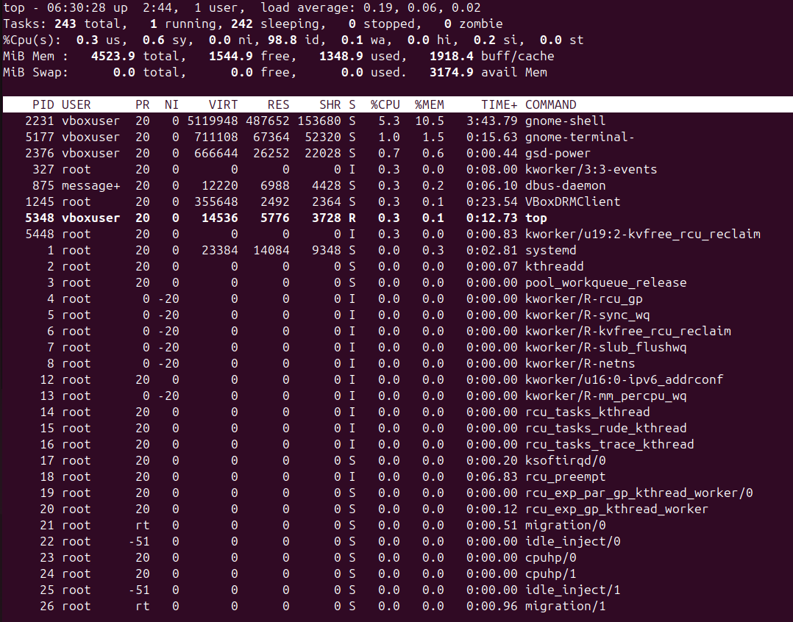
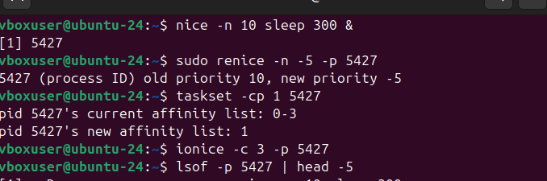
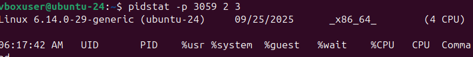

### COMMANDS ###

## 1. ps aux
**Explanation:**

a → show processes for all users

u → show user/owner of process

x → show processes not attached to a terminal

***Example Output:**
 
  

### 🌲 2. Process Tree 

**Command:**

pstree -p

**Example Output:**

 

**👉 Shows parent-child process relationships.**

**📊 3. Real-Time Monitoring**

Command:

top

**Example Output (partial):**

### ⚡ 4. Adjust Process Priority

**Start a process with low priority:**

nice -n 10 sleep 300 &

OUTPUT:

### 📂 6. I/O Scheduling Priority

Command:
ionice -c 3 -p 3050

***Output:**

successfully set pid 3050's IO scheduling class to idle

### 📑 7. File Descriptors Used by a Process

**Command:**

lsof -p 3050 | head -5 

### 📡 9. Find Process Using a Port

**Command:**

sudo fuser -n tcp 8080

**Output:**

**8080/tcp:           4321**

### 📊 10. Per-Process Statistics

**Command:**

pidstat -p 3050 2 3

**Example Output:**

### 🔐 11. Control Groups (cgroups) for Resource Limits
**Create a new cgroup:**

sudo cgcreate -g cpu,memory:/testgroup

**Limit CPU and Memory:**
**echo 50000 | sudo tee /sys/fs/cgroup/cpu/testgroup/cpu.cfs_quota_usecho 100M   | sudo tee /sys/fs/cgroup/memory/testgroup/memory.limit_in_bytes**

 

